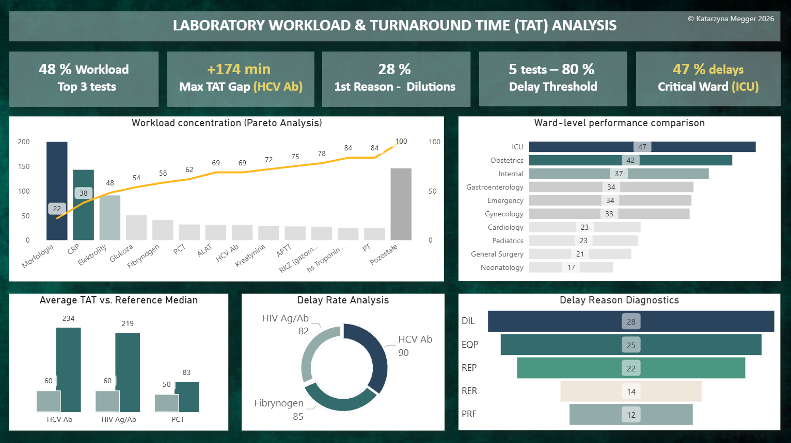

📊 Laboratory Workload & Turnaround Time Analysis (SQL)

🚀 About the Project
This project was developed as my first portfolio project during my career transition into data analytics. It showcases a comprehensive analysis of laboratory test orders, focusing on workload distribution and Turnaround Time (TAT) efficiency.
The project demonstrates my ability to model real-world healthcare data within defined analytical constraints, emphasizing process-level efficiency rather than clinical assessment.

🎯 Project Goal
The primary objective is to identify laboratory tests and hospital wards that generate the highest workload and to analyze how this workload relates to turnaround time, bottlenecks, and delays.

📁 Data Model
The analysis is built on a relational database schema named full_lab_project, consisting of 6 interconnected tables:
• Orders: Transactional data for 200 unique laboratory orders.
• Tests: Catalog of 25 tests with defined benchmarks (median TAT and delay thresholds).
• Patients: Demographic data for 200 individuals.
• Wards: Directory of 10 hospital departments (e.g., Emergency, ICU, Cardiology).
• Doctors & Diagnosticians: Staff records for ordering and performing tests.

🔍 Scope Definition & Design Decisions
• Clinical Consistency: To reflect real-world data validation, adults (>18 years) originally assigned to Pediatrics or Gynecology were redirected to Internal Medicine to ensure the logical integrity of the data model.
• Strategic Data Modeling: Intentional delays were introduced in 60-80% of critical test records to provide a robust dataset for meaningful bottleneck and procedural failure analysis.
• Defined Analytical Constraints: While the database reflects real-world complexity (including doctor specializations and abnormal flags), these were deliberately excluded from the current audit to maintain a strict focus on process-level workload and turnaround time patterns

🧠 Analysis Modules
1. Workload Concentration (Pareto): Identifying high-impact tests that drive the majority of the laboratory volume.
2. Turnaround Time (TAT) Analysis: Comparing actual processing times against reference medians and identifying delay rates.
3. Ward-Level Performance: Comparing service efficiency across different hospital units.
4. Delay Reason Diagnostics: Identifying technical root causes for delays, such as equipment issues (EQP), dilutions (DIL), or repetitions (REP).

🛠️ SQL Techniques Used
• Joins & Aggregations: Linking multiple tables and calculating metrics (COUNT, AVG, SUM).
• Window Functions: SUM() OVER for Pareto analysis and percentage share calculations.
• Common Table Expressions (CTEs/WITH): Structuring complex queries for better readability.
• Conditional Logic: CASE WHEN for flagging delayed orders and status classification.

📊 Interactive Dashboard & Business Insights
While the SQL backend handles data extraction and modeling, the final analysis is presented through an interactive Power BI dashboard. This visualization translates complex datasets into actionable insights for laboratory management.

📈 Key Insights
• Pareto Concentration (44/80): Analysis shows that 11 out of 25 tests (44%) generate nearly 80% (78.22%) of the total volume. 
The "Big Three" (Morphology, CRP, Electrolytes) alone account for 48.22% of the workload.
• Routine Test Stability: High-volume routine tests (Morphology, Glucose) are highly efficient, with deviations from the median as low as +0.4 to +0.6 minutes.
• CRP as a Primary Bottleneck (Dilution Impact): Despite being one of the "Big Three" high-volume tests, CRP consistently exceeds its target median (30 min) by 18.0 minutes. Detailed diagnostics from Module 4 reveal that this delay is primarily driven by the necessity for sample dilutions (DIL). This occurs when analyte concentrations exceed
the analyzer's linear measurement range—a common occurrence in inflammatory states—requiring additional manual or automated steps that extend the total processing time.
• STAT Prioritization Efficiency: Life-saving tests like Blood Gas Analysis (Gazometria) consistently achieve times below the target median (-1.1 min), confirming that prioritization protocols for Emergency and ICU departments function correctly even during high-load periods.

🏁 Conclusion 
This project demonstrates that laboratory delays are often localized and technical rather than systemic. By identifying specific bottlenecks—such as CRP delays caused by necessary sample dilutions (DIL) due to high analyte concentrations—the analysis provides actionable data for laboratory management. These insights allow for targeted operational improvements, such as optimizing dilution protocols or upgrading analyzer capacity for high-volume tests, to enhance workflow efficiency independently of clinical judgment. Ultimately, this audit proves that data-driven monitoring can successfully isolate procedural hurdles from routine stability

